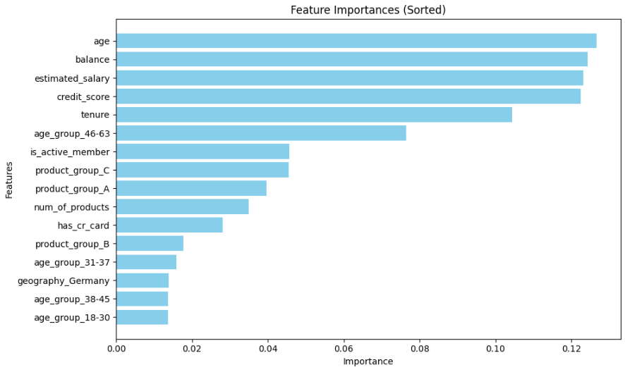
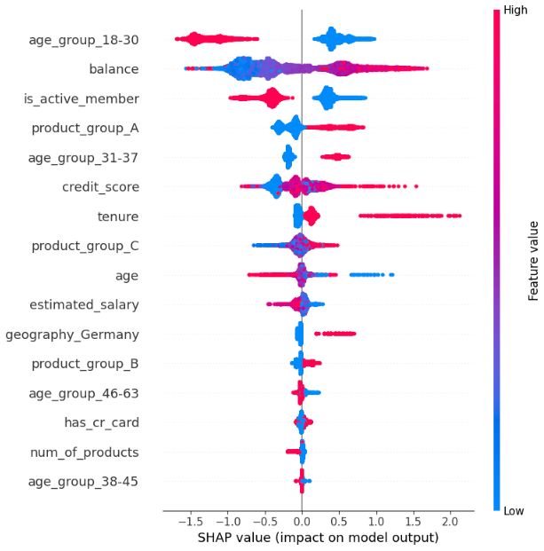
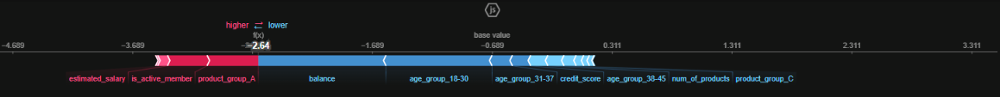

# Financial-Institution-Churn-Prediction

## Summary 
- [1. Project Planning](#1-project-planning)
- [2. Data Dictionary](#2-data-dictionary)
- [3. Data Cleaning](#3-data-cleaning)
- [4. Descriptive Statistics](#4-descriptive-statistics)
- [5. Feature Engineering](#5-feature-engineering)
- [6. Data Preparation](#6-data-preparation)
- [7. Feature Selection](#7-feature-selection)
- [8. Machine Learning](#8-machine-learning)
- [9. Business and Financial Results](#9-business-and-financial-results)
- [10. Improvements for Next Cycles](#10-improvements-for-next-cycles)
- [11. Project Usage Instructions](#11-project-usage-instructions)

## 1. Project Planning

### 1.1 Business problem
- The financial institution has an estimated churn retention rate of 28%/year.
- A new retention goal was announced for next year, which is 40%. To achieve this, the customer retention team needs a churn prediction model.
- The model must be at least 55% effective in identifying true churners, while avoiding false positives.
- This way, the retention team will act using the model to reverse at least 80% of churns, which results in 44% retention, reaching the goal.

### 1.2 Problem type: Binary Classification
- The 'abandono_clientes.csv' dataset contains 10k rows and 13 features, which is enough to create a supervised machine learning model using a frequentist approach.
- To deal with this churn problem, some classification models with different approaches will be created, and the best one will be used.

### 1.3 Evaluation metric: F1 score 
- F1 score will be the metric used with cross-validation, considering:
    - The business team needs a good balance between finding actual churners (recall) and avoiding false alarms (precision). 
    - Focuses on minority class (churners) performance without being skewed by majority class dominance (imbalanced dataset: 20% churned).

### 1.4 Methodology: CRISP-DM
- Cross Industry Standard Process for Data Mining methodology will be used, being cyclical and flexible, in order to take advantage of best market practices.

### 1.5 Project deliverables:
- EDA Notebook: [notebooks/v2_EDA.ipynb]
    - Univariate, bivariate and multivariate statistical analysis of data.
    - Business Insights from variables.
- Modeling Notebook: [notebooks/v1_modeling.ipynb] 
    - Churn prediction model with a baseline > 0.55 on test data: 55% effectiveness in identifying true churners.
    - Model Explainability.
    - Business and financial results.
- CSV file with:
    - 'abandono_result.csv' file, being the model predictions from 'abandono_teste.csv'.

## 2. Data Dictionary

|  Column   | Meaning   |
| :-------  | :------- |
| **RowNumber** | Record number |
| **CustomerId** | Customer ID |
| **Surname** | Customer's last name |
| **CreditScore** | Customer's credit score |
| **Geography** | Customer's country of residence |
| **Gender** | Costumer's gender |
| **Age** | Costumer's age |
| **Tenure** | Number of years that the customer has been a client of the institution |
| **Balande** | Ammount of money the client have on it's account |
| **NumOfProducts** | Number of products that a customer has purchased through the institution |
| **HasCrCard** | Denotes whether or not a customer has a credit card with the institution. [1 - has credit card; 0 - dosen't have credit card] |
| **IsActiveMember** | Denotes whether client is active or not. [1 - active; 0 - non active ] |
| **EstimatedSalary** | Client's estimated anual salary |
| **Exited** | Denotes whether the client has an account at the institution. [1 - Client has exited instittion; 0 - client dosen't have exited institution] |

## 3 Data Cleaning
Process:
- Features were renamed.
- DTypes, missings and duplicates were inspected.
- Irrelevant features were removed: row_number', 'customer_id' and 'surname'.

## 4. EDA

### 4.1 Univariate Analysis 

Descriptive Analysis. 

Composed of:
- Location Metrics (central tendency), that show where the data is centered, such as mean and median.
- Variability Metrics (cispersion), that reveal how the values are spread around that center, such as standard deviation, quantiles, skewness and kurtosis.

Below, all the numerical variables in the dataset will be analyzed.

|     variable     |   non-null |    range |     min  |   quant25 |  median |  quant75 |     max   |  mean     | skew     |  std      |kurtosis   |
| :--------------- | --------:  | -----:   | -----:   | -------:  | ------: | -------: | -------:  | --------: | -------: | -------:  | --------: |
| credit_score     |   8000     |    500.0 |    350.0 |  583.0    |   652.0 |   716.0  |    850.0  |   649.9   |  96.7    |   -0.1    |   -0.4    |
| age              |   8000     |  74.0    |    18.0  |  32.0     |  37.0   |   44.0   |   92.0    |   38.9    |   10.4   |    1.0    |    1.4    | 
| tenure           |   8000     |   10.0   |    0.0   |   2.0     |   5.0   |    7.0   |   10.0    |    5.0    |    2.9   |    0.0    |    -1.2   |   
| balance          |   8000     | 250898.1 |     0.0  |    0.0    | 97276.1 | 127743.6 | 250898.1  |  76673.7  | 62487.0  |    -0.1   |   -1.5    | 
| num_of_products  |   8000     |   3.0    |    1.0   |    1.0    | 1.0	    |  2.0	   |  4.0	   |   1.5	   |    0.6   |    0.8    |    0.6    |    
| has_cr_card      |   8000     |   1.0    |    0.0   |    0.0    |  1.0    |  1.0     |   1.0     |   0.7     |    0.5   |    -0.9   |    -1.2   |    
| is_active_member |   8000     |   1.0    |    0.0   |    0.0    |   1.0	|  1.0     |  1.0	   |   0.5     |    0.5   |    -0.1   |   -2.0    |   
| estimated_salary |   8000     | 199902.4 |    90.1  | 51986.1	  | 100487.7|149216.3  | 199992.5  | 100467.8  | 57274.2  |    -0.0   |     -1.2  | 

Analysis:
- age: has positive kurtosis, so there is a spike arround the median.
- balance: quant25 shows 0.00, meaning at least 25% of data equals to zero. No negative values were found.
- num_of_products: max is 4, but median is 1, so at least 50% of customers have only 1 product.
- has_cr_card: negative skew shows that the concentration of values is high, so most customers have a credit card.
- estimated_salary: skew 0.00 shows that estimated salaries are not concentrated in low or high values, having an uniform distribuition.
- exited: positive skew shows that the concentration of values is low, with most values being zero, as expected for a churn problem.							

Target, numerical and categorical analysis can be seen in details, on EDA notebook.

### 4.2 Bivariate Analysis
The analysis was performed using Sweetviz plots in EDA V1. 
In V2, complements in bivariate analysis were implemented, with improvements in data interpretation, creation and validation of hypotheses, and new ideas for feature engineering.

### 4.3 Multivariate Analysis
In V2, a multivariate analysis were implemented, with Pearson's correlation and Cramér's V.

## 5. Feature Engineering
4 features were created:
- geo_gender: Creates gender vs geography groups, resulting in a new feature that summarizes the information content of both.
- age_group: Create age groups from age, calibrating to make them balanced. In this way, in the case of ages that are underrepresented, the bin may make it easier for the model to recognize them. 
- balance_group: Create a binary indicator for balance: center vs tail (tail: except customers with a balance = 0, those with less than 50k and with more than 200k churned more vs rest).
- product_group: Create a scale for num_of_product: "C" for 2 products, "B" for 1 product, "A" for 3 or 4 products (3 groups), in order to create a kind of scale by churn level, helping models to identify churn.

## 6. Data Preparation
Feature Scaling and Transformations were be applied to the dataset, to avoid biased results, accelerate training, and improve interpretability.

### 6.1 Feature Scaling
Feature Scaling: makes numerical features comparable, preventing dominance of larger-scale features, and iproves model convergence.
- A Shapiro-Wilk test on numerical features were used, to identify which are normally distributed. Since none was, a MinMaxScaler were used.

### 6.2 Transformations
Transformations: handles categorical data, fixes non-linear relationships and reduces data skewness.
- OneHotEncoder was used for first cycle due to deadline restrictions, but specific transformations for each feature on next cycle were mentioned, with its benefits.

## 7. Feature Selection
An ExtraTreesClassifier were used to rank features by importance.
- This reduces model complexity, improves model performance, and makes ir more interpretable.
- The ExtraTreesClassifier builds 50 random decision trees, and each tree votes on which features are important, so the average importance of each feature is calculated.
- Selected features were those with above 30% of the mean importance ("0.3*mean").

Features selected:

------------------------------
## 8. Machine Learning
BayesSearchCV was used to evaluate different ML and its hyperparameters with Cross Validation.

It uses Bayesian Optimization to find the best hyperparameters, through Exploration vs Exploitation: 
- Exploration: Trying new areas of the parameter space.
- Exploitation: Focusing on areas known to give good results.

### 8.1 Models Evaluated
3 ML models with different approaches were tried:
- Linear Discriminant Analysis (LDA): linear classifier, similar to Logistic Regression. It can handle class imbalance through prior probabilities adjustment. It is widely used supervised algorithms for churn prediction.
- RandomForestClassifier approach: builds multiple decision trees in parallel independently.
- XGBoostClassifier approach: builds trees sequentially, with each new tree correcting errors from previous ones. Better handles class imbalance than RF, but more computationally intensive.

The best model evaluated was an XGBoostClassifier.
Pros:
- Handles non-linear relationships between features naturally.
- Better at handling imbalanced datasets compared to basic algorithms (scale_pos_weight parameter).
- Offers multiple hyperparameters for fine-tuning.

Cons:
- Performance deteriorates with highly imbalanced datasets (especially < 5% minority class, which is not the case)
- Requires a more attentive hyperparameter tuning
- Works best with larger datasets than this (8k rows)

### 8.2 Evaluation Metric
F1 score will be the metric used, considering:
- Business team needs a good balance between finding actual churners (recall) and avoiding false alarms (precision).
- Focuses on minority class (churners) performance without being skewed by majority class dominance (imbalanced dataset: 20% churned).

### 8.3 Model Explainability
The model predictions were explained with SHAP (SHapley Additive exPlanations), using TreeExplainer, because it is optimized for tree-based models like XGBoost.

Details about how to interpret the summary plot and individual predictions can be found on modeling notebook.

#### 8.3.1 Summary Plot

Exemple of Churn Interpretation:
- age_group_18-30: customers within this age group have lower churn probability (all blue dots are on right)
- balance: most customers with higher balance values have higher churn probability (most of red dots are on right)
- is_active_member: customers who are active memers have lower churn probability (all blue dots are on right)
- product_group_A: customers on group A (they have 3 or 4 products) have higher churn probability (all red dots are on right)

Summary plot:

#### 8.3.2 Individual Predictions

Example of Churn Interpretation for one customer's prediction:
- few features contributing to push toward churn. One of them is:
  - product_group_A: customers on group A (they have 3 or 4 products) have higher churn probability.

- more features pushing predictions away from churn and with greater intensity. The 2 main are: 
  - age_group_18-30: customers within this age group have lower churn probability.
  - balance: customers with low balance values have lower churn probability.

Individual Predictions:

### 8.4 Churn Predictions
The XGBoost was the choosen model, and a complete pipeline was created in order to predict churn of test data. The process createt was:
- Rename Features
- Feature Filtering
- Feature Engineering
- Preprocessing
- Feature Selection
- Model Training

Test data were passed to the model, and a F1-score for class 1 of 0.58 were obtained. It means the model has 58% effectiveness in identifying true churners in this first cycle.

The best model were retrained with all train + test data, in order to improve performance for final prediction (abandono_teste.csv).

Churn prediction of the 1000 rows were made, and exporeted. It is available in data/result/abandono_result.csv.

## 9.0 Business and Financial Results

### 9.1 Busness Results
- The fraud prediction model in it's first cycle delivers 58% effective in identifying true churners.
- The result expected by retention team was a model with at least 55% effectiveness, wich was attained.
- Now the project can be put into production, and the retention team can then start using it.

### 9.2 Financial Results
Premisses:
- Model effectiveness for churners (F1-score) is 0.58.
- Company has a base of 10 million customers.
- Average estimated cost per churned customer: R$ 750 / year.
- Average estimated churn rate: 18% / year -> 1.800.000 customers/year.

Current 1 year scenario without the model:
- Estimated churn company's retention rate: 28% / year.
- Estimated churn cost: RS 972.000.000/year (72% of 1.800.000 customers * RS 750)

Current 1 year scenario using the model:
- Estimated churn company's retention rate: 46% / year (model identifies 58%, and 80% is retained). 
- Estimated churn cost: RS 729.000.000/year (54% of 1.800.000 customers * RS 750)

Estimated Savings using the model: RS 243.000.000/year.

Considering the model is on cycle 1, and there is a lot of opportunity to improve it, the result can be even greater in the future.

## 10 Improvements for Next Cycles

**Modeling:**

- Feature engineering:
  - Statistically validate using the Kruskal-Wallis test, which features from feature engineering have significant differences between groups, then decide if they may be included on project.
  - Increase the number of derived features in feature engineering, trying interactions and polynomials.
  - Running a clustering to identify natural groups of customers, and create a new feature using this labels.

- Data Preparation:
  - Replace One Hot Encoding with Ordinal, Binary and Target encodings, to reduce dataset dimensionality and support data drifts, as detailed in Data Preparation section.

- Feature Selection:
  - Since I will be testing not only tree-based models, it makes sense to check for highly correlated features among selected features, thay may be sensitive to multicollinearity.
  - Implement a stratified cross-validation for feature selection, to get a consistent performance across different data splits, getting more robust feature importance scores.

- Machine Learning:
  - Evaluate other models like TabPFN (deep learning), who has excellent out-of-box performance without hyperparameter tuning, has built-in uncertainty estimation, and has been outperforming XGBoost on small datasets like this. 
  - Hyperparameter Tuning: evaluate more model parameters that affect model complexity, to get even better fine tuning result with BayesSearchCV.
  - Improve the f1_score of class 1 with new feature engineering, class balancing and changes on feature selection, to identify more discriminative features.

**Support for retention team: (beyond model predictions):**

Model explaniability:
  - Create user-friendly interface for retention teams to access SHAP global and individual explanations. This way, they can approach the customer in a customized way, based on the factors that most contribute to their churn, further increasing the churn retention rate.
  - Build a calibrated probability model based on XGBoost (CalibratedClassifierCV) that creates reliable churn likelihood bands, enabling the retention team to optimize resource allocation based on different probability ranges of customer churn.

Churn expected date:
  - Collecting time series data, survival analysis models that estimate the time to an event could be used, to identify when a customer would churn. This would be handy, because the retention team could use different retention approaches, depending on the customer's stage. 

## 11 Project Usage Instructions
Follow this instructions to use this project:

- Start creating a virtual environment with Python version = 3.12.4.
- Use the 'requirements.txt' file to install all packages inside using command: 'pip install -r requirements.txt'
- Rename the CSV file you want to use as a dataset for new predictions as 'abandono_teste.csv', and replace it on data\test folder.
- The new predictions by default will be exported to data/result.

