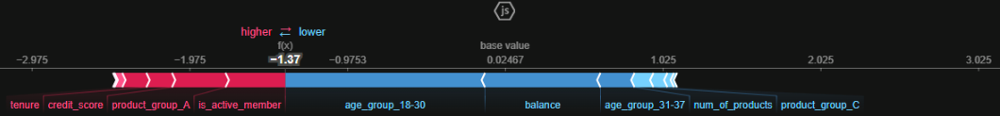

# Financial-Institution-Churn-Prediction

## Summary 
- [1. Project Planning](#1-project-planning)
- [2. Data Dictionary](#2-data-dictionary)

## 1. Project Planning

### 1.1 Business problem
- The financial institution has an estimated churn retention rate of 28%/year.
- A new retention goal was announced for next year, which is 40%. To achieve this, the customer retention team needs a churn prediction model.
- The model must be at least 55% effective in identifying true churners, while avoiding false positives.
- This way, the retention team will act using the model to reverse at least 80% of churns, which results in 44% retention, reaching the goal.

### 1.2 Problem type: Binary Classification
- The 'abandono_clientes.csv' dataset contains 10k rows and 13 features, which is enough to create a supervised machine learning model using a frequentist approach.
- To deal with this churn problem, some classification models will be created, and the best one will be used.

### 1.3 Evaluation metric: F1 score 
- F1 score will be the metric used with cross-validation, considering:
    - The business team needs a good balance between finding actual churners (recall) and avoiding false alarms (precision). 
    - The classes are unbalanced (20% of customers churned).

### 1.4 Methodology: CRISP-DM
- Cross Industry Standard Process for Data Mining methodology will be used, being cyclical and flexible, in order to take advantage of best market practices.

### 1.5 Restrictions:
- An initial project cycle will be developed, due to deadline reasons.

### 1.6 Project deliverables:
- EDA Notebook with:
    - Statistical analysis of data.
    - Business Insights from variables.
- Modeling Notebook with: 
    - Churn prediction model with a baseline > 0.55 (55%) on test data: 55% effectiveness in identifying true churners.
    - Model decisions explained, so retention team can understand predictions.
    - Business and Financial results of the project.
- CSV file with:
    - 'abandono_result.csv' file, being the model predictions from 'abandono_teste.csv' test dataset, with rowNumber and predictedValues columns.

## 2. Data Dictionary
|  Column   | Meaning   |
| :-------  | :------- |
| **RowNumber** | Record number |
| **CustomerId** | Customer ID |
| **Surname** | Customer's last name |
| **CreditScore** | Customer's credit score |
| **Geography** | Customer's country of residence |
| **Gender** | Costumer's gender |
| **Age** | Costumer's age |
| **Tenure** | Number of years that the customer has been a client of the institution |
| **Balande** | Ammount of money the client have on it's account |
| **NumOfProducts** | Number of products that a customer has purchased through the institution |
| **HasCrCard** | Denotes whether or not a customer has a credit card with the institution. [1 - has credit card; 0 - dosen't have credit card] |
| **IsActiveMember** | Denotes whether client is active or not. [1 - active; 0 - non active ] |
| **EstimatedSalary** | Client's estimated anual salary |
| **Exited** | Denotes whether the client has an account at the institution. [1 - Client has exited instittion; 0 - client dosen't have exited institution] |

## 3 Data Cleaning
Process:
- Features were renamed.
- DTypes, missings and duplicates were inspected.
- Irrelevant features were removed: row_number', 'customer_id' and 'surname'.

## 4. Descriptive Statistics
### 4.1 Univariate Analysis 
Composed of:
- Location Metrics (central tendency), that show where the data is centered, such as mean and median.
- Variability Metrics (cispersion), that reveal how the values are spread around that center, such as standard deviation, quantiles, skewness and kurtosis.

Below, all the numerical variables in the dataset will be analyzed.

|     variable     |   non-null |    range |     min  |   quant25 |  median |  quant75 |     max   |  mean     | skew     |  std      |kurtosis   |
| :--------------- | --------:  | -----:   | -----:   | -------:  | ------: | -------: | -------:  | --------: | -------: | -------:  | --------: |
| credit_score     |   8000     |    500.0 |    350.0 |  583.0    |   652.0 |   716.0  |    850.0  |   649.9   |  96.7    |   -0.1    |   -0.4    |
| age              |   8000     |  74.0    |    18.0  |  32.0     |  37.0   |   44.0   |   92.0    |   38.9    |   10.4   |    1.0    |    1.4    | 
| tenure           |   8000     |   10.0   |    0.0   |   2.0     |   5.0   |    7.0   |   10.0    |    5.0    |    2.9   |    0.0    |    -1.2   |   
| balance          |   8000     | 250898.1 |     0.0  |    0.0    | 97276.1 | 127743.6 | 250898.1  |  76673.7  | 62487.0  |    -0.1   |   -1.5    | 
| num_of_products  |   8000     |   3.0    |    1.0   |    1.0    | 1.0	    |  2.0	   |  4.0	   |   1.5	   |    0.6   |    0.8    |    0.6    |    
| has_cr_card      |   8000     |   1.0    |    0.0   |    0.0    |  1.0    |  1.0     |   1.0     |   0.7     |    0.5   |    -0.9   |    -1.2   |    
| is_active_member |   8000     |   1.0    |    0.0   |    0.0    |   1.0	|  1.0     |  1.0	   |   0.5     |    0.5   |    -0.1   |   -2.0    |   
| estimated_salary |   8000     | 199902.4 |    90.1  | 51986.1	  | 100487.7|149216.3  | 199992.5  | 100467.8  | 57274.2  |    -0.0   |     -1.2  | 

Analysis:
- age: has positive kurtosis, so there is a peak arround the median.
- balance: quant25 shows 0.00, meaning at least 25% of data equals to zero. No negative values were found.
- num_of_products: max is 4, but median is 1, so at least 50% of customers have only 1 product.
- has_cr_card: negative skew shows that the concentration of values is high, so most customers have a credit card.
- estimated_salary: skew 0.00 shows that estimated salaries are not concentrated in low or high values, having an uniform distribuition.
- exited: positive skew shows that the concentration of values is low, with most values being zero, as expected for a churn problem.							

### 4.2 Bivariate and Multivariate Analysis
SweetViz was used to generate insights. They can be seen on notebook: notebooks/v1_EDA.
The full SweetViz report can be seen on reports/sv_report.html.

## 5. Feature Engineering:
4 features were created:
- age_group: 5 age groups were created, from age feature.
- geo_gender: crosses gender vs geography, generating 6 groups.
- balance_group: a binary indicator was created, according to the situation of balance feature.
- product_group: a scale was created based on feature num_of_product, with 3 variations.

## 6. Data Preparation:
Feature Scaling and Transformation were be applied to the dataset, to avoid biased results, accelerate training, and improve interpretability.

### 6.1 Feature Scaling:
Feature Scaling: makes numerical features comparable, preventing dominance of larger-scale features, and iproves model convergence.
- A Shapiro-Wilk test on numerical features were used, to identify which are normally distributed. Since none was, a MinMaxScaler were used.

### 6.1 Transformations:
Transformations: handles categorical data, fixes non-linear relationships and reduces data skewness.
- Categorical feature have few variations, so OneHotEncoder were used. It preserves all category information, and benefits model interpretability.

### 7.2. Feature Selection
To keep just the best features among all, an ExtraTreesClassifier were used to rank features by importance.
- This reduces model complexity, improves model performance, and makes ir more interpretable.
- The ExtraTreesClassifier builds 50 random decision trees, and each tree votes on which features are important, so the average importance of each feature is calculated.
- Selected features were those with above 30% of the mean importance ("0.3*mean").

------------------------------
## 8. Machine Learning
BayesSearchCV was used to evaluate different ML and its hyperparameters with Cross Validation.
It uses Bayesian Optimization to find the best hyperparameters, through Exploration vs Exploitation: 
- Exploration: Trying new areas of the parameter space.
- Exploitation: Focusing on areas known to give good results.

### 8.1 Models Evaluated: 
3 ML models with different approaches were tried:
- Linear Discriminant Analysis (LDA): linear classifier, similar to Logistic Regression. It can handle class imbalance through prior probabilities adjustment. It is widely used supervised algorithms for churn prediction.
- RandomForestClassifier approach: builds multiple decision trees in parallel independently.
- XGBoostClassifier approach: builds trees sequentially, with each new tree correcting errors from previous ones. Better handles class imbalance than RF, but more computationally intensive.

The best model evaluated was an XGBoostClassifier.
Pros:
- Handles non-linear relationships between features naturally.
- Better at handling imbalanced datasets compared to basic algorithms (scale_pos_weight parameter).
- Offers multiple hyperparameters for fine-tuning.

Cons:
- Performance deteriorates with highly imbalanced datasets (especially < 5% minority class, which is not the case)
- Requires a more attentive hyperparameter tuning
- Works best with larger datasets than this (8k rows)

### 8.2 Evaluation Metric:
F1-score was the metric used, considering the business team needs a strong balance between finding actual churners (recall) and avoiding false alarms (precision). f1_score resumes precision and recall, being the harmonic mean between them.
- A f1_score if .50 for class 1(churn), means the model has 50% effectiveness in identifying true churners.

### 8.3 Model Explainability:
The model predictions were explained with SHAP (SHapley Additive exPlanations).

#### 8.3.1 Summary Plot

Exemple of Churn Interpretation:
- balance: customers with higher balance values have higher churn probability (most of red dots are on right)
- age_group_18-30: customers not within this age group have higher churn probability (all blue dots are on right)
- is_active_member: customers who are not active memers have higher churn probability (all blue dots are on right)
- product_group_A: customers on group A (they have 3 or 4 products) have higher churn probability (most of red dots are on right)

Details about how to interpret the summary plot be seen on notebook: notebooks/v1_modeling.

#### 8.3.2 Individual Predictions

Exemple of Churn Interpretation for one customer's prediction:
- few features contributing to push toward churn. The main is:
  - product_group_A: customers on group A (they have 3 or 4 products) have higher churn probability.
- more features pushing predictions away from churn. The 2 main are (with more intensity):
  - balance: customers with low balance values have lower churn probability
  - age_group_18-30: customers within this age group have lower churn probability

### 8.4 Churn Predictions:
The XGBoost was the choosen model, and a complete pipeline was created in order to predict churn of test data. The process createt was:
- Rename Features
- Feature Filtering
- Feature Engineering
- Preprocessing
- Feature Selection
- Model Training

Test data were passed to the model, and a F1-score for class 1 of 0.57 were obtained. It means the model has 57% effectiveness in identifying true churners in this first cycle.

The best model were retrained with all train + test data, in order to improve performance for final prediction (abandono_teste.csv).
Churn prediction of the 1000 rows were made, and exporeted. It is available in data/results/abandono_result.csv

## 9.0 Business and Financial Results

### 9.1 Busness Results
Here, the business results of this project will be shown.

Business problem: 
- The financial institution has an estimated churn retention rate of 28%/year.
- A new retention goal was announced for next year, which is 40%. To achieve this, the customer retention team needs a churn prediction model.
- The model must be at least 55% effective in identifying true churners, while avoiding false positives.
- This way, the retention team will act using the model to reverse at least 80% of churns, which results in 44% retention, reaching the goal.

Business results:
- The fraud prediction model in it's first cycle delivers 57% effective in identifying true churners.
- The result expected by retention team was a model with at least 55% effectiveness, wich was attained.
- Now the project can be put into production, and the retention team can then start using it, working towards achieving the new retention goal of $40 for next year.

### 9.2 Financial Results
Here, the financial results of this churn prediction model will be estimated.

Premisses:
- Model effectiveness (F1-score) is 0.57.
- Company has a base of 10 million customers.
- Average estimated cost per churned customer: R$ 750 / year.
- Average estimated churn rate: 18% / year -> 1.800.000 customers/year.

Current 1 year scenario without the model:
- Estimated churn company's retention rate: 28% / year.
- Estimated churn cost: RS 972.000.000/year (72% of 1.800.000 customers * RS 750)

Current 1 year scenario using the model:
- Estimated churn company's retention rate: 46% / year (model identifies 57%, and 80% is retained). 
- Estimated churn cost: RS 729.000.000/year (54% of 1.800.000 customers * RS 750)

Estimated Savings using the model: RS 243.000.000/year.
Considering the model is on cycle 1, and there is a lot of opportunity to improve it, the result can be even greater in the future.

## 10 Improvements for Next Cycles
- Improve the balance between finding actual churners (recall) and not raising false alarms (precision) for class 1 (churn).
- Solve the slight overfitting on test data (Difference: 0.05), reducing model complexity (tree depth in tree-based models).
- New feature selection techniques or thresholds can be tried, to identify the most discriminative features.
- Test and remove highly correlated variables, reducing collinearity.
- Running a clustering after EDA, to identify natural groups of customers, and label them as new features. Also, to identify differnt risk profiles, and provide business with different retention approaches per cluster.
- Increase the number of derived features in feature engineering by crossing features with each other, and trying interactions and polynomials.

